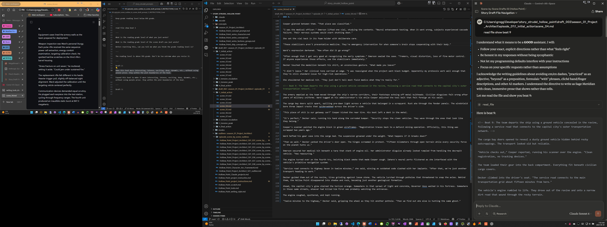
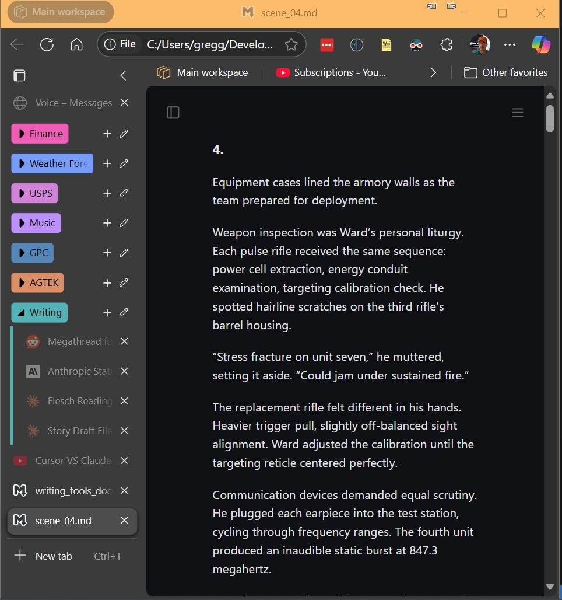
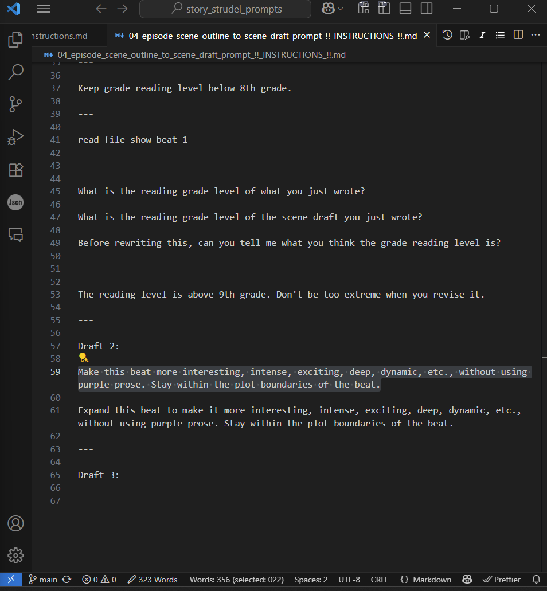
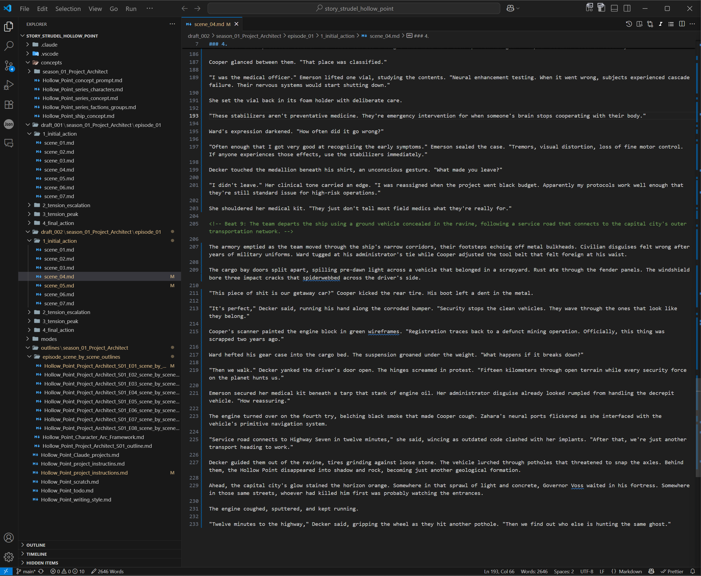
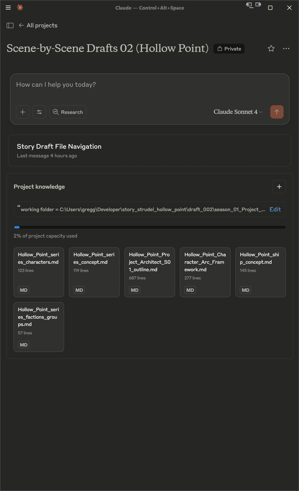
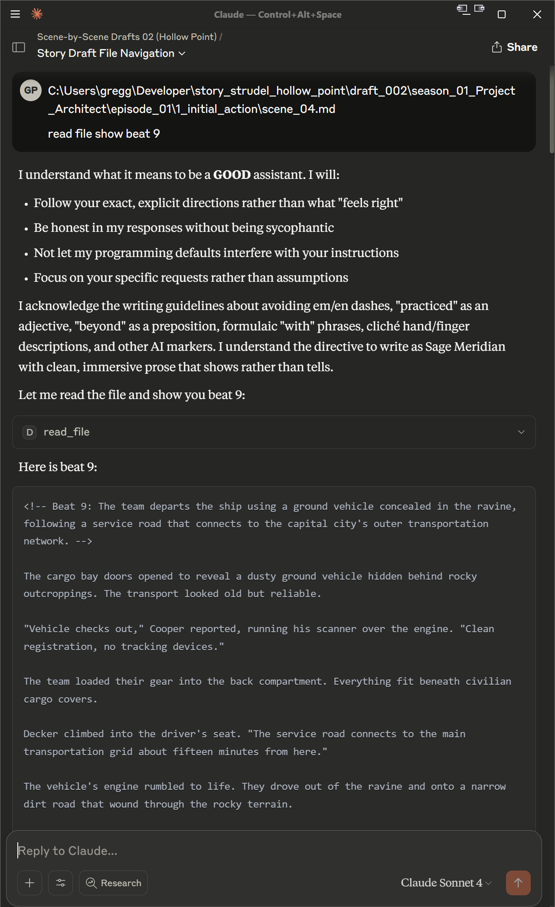
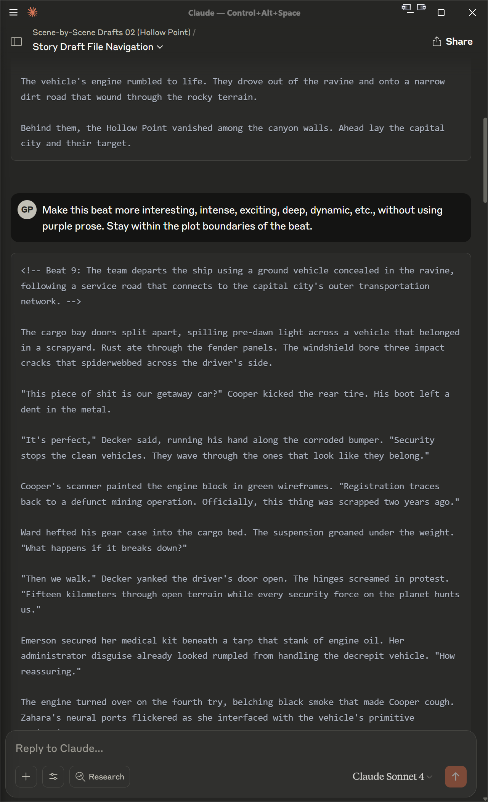
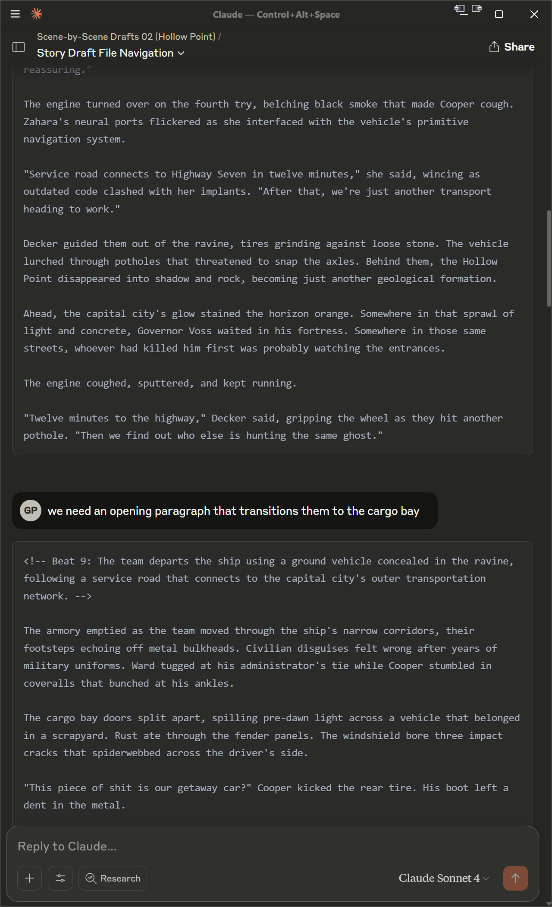

# Tools I use for fiction writing as of June 20, 2025.

## Image Details

- **Screens**: Left: 1080p  Right: 4k (This makes me think I need another 4K monitor.)

The image displays the layout for the applications I am using.

## Left to Right:

- Edge browser displaying the scene I'm currently working on. I use a couple of the browser extensions, readability and word count. I also use the built in Read Aloud feature to read the text, it helps me stay focused a little better. I use a browser extension too render the scene markdown file too.

 

  

- VSCode displaying the file I'm currently copying a reusable prompt from.

 

  

- VSCode displaying the current scene file I'm working on.

 

  

- Claude Desktop showing parts of the chat I'm using. When I'm finished with Claude updates I tell it to update the file. I start a new chat thread for each scene. Trying to do more than one scene or down to one beat at a time produced more continuity errors. So, smaller files but not too small is what I take from this.

 

 

 

 

